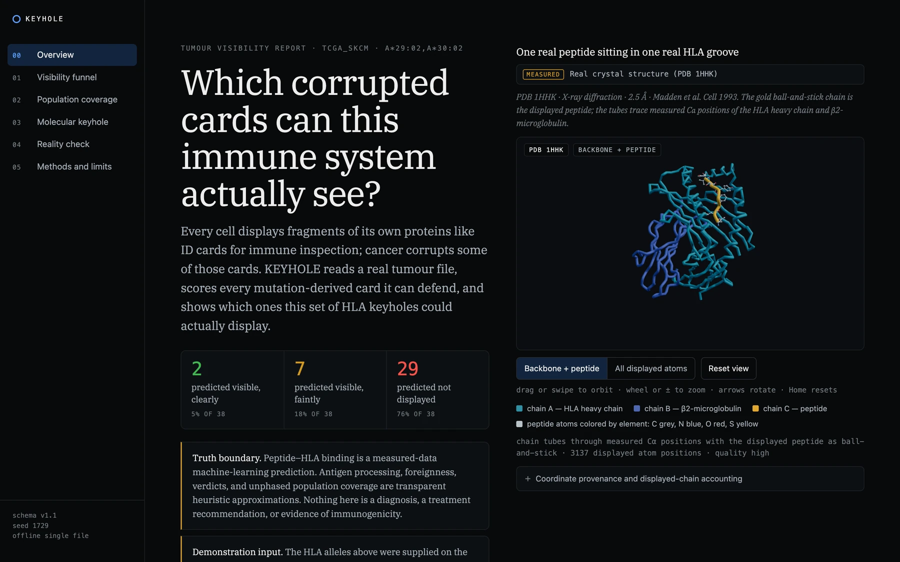
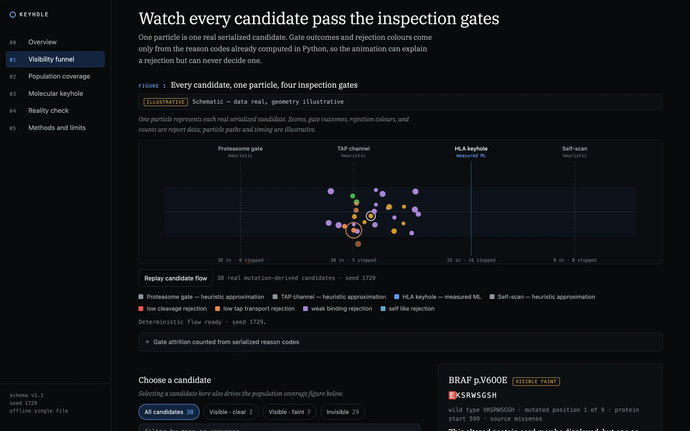
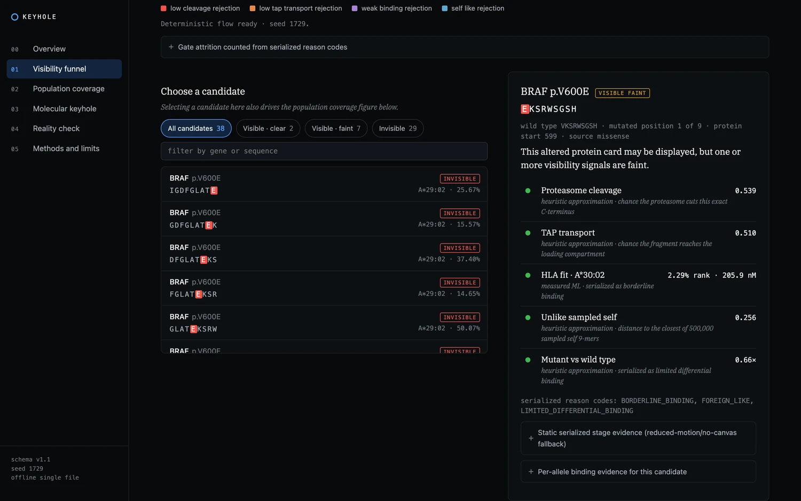
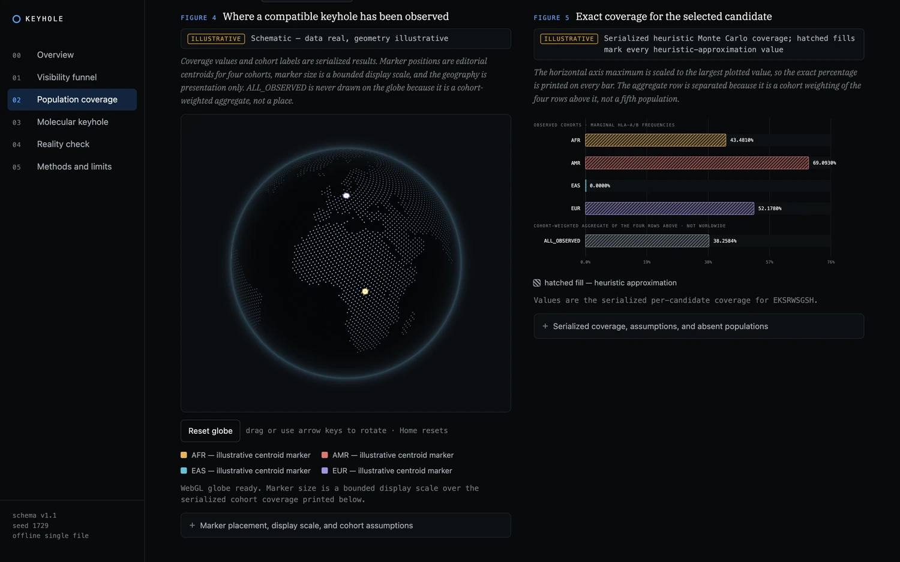
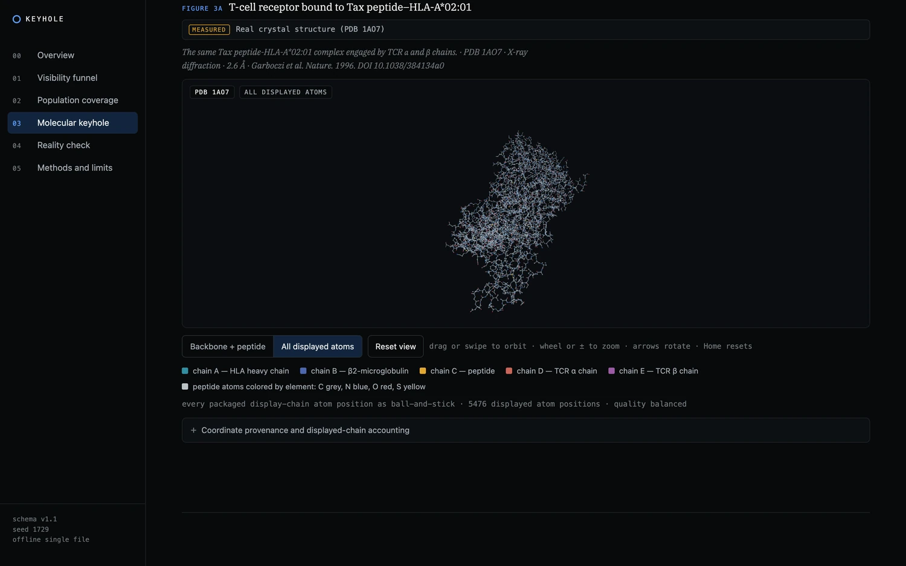

<div align="center">

# KEYHOLE

**Reads a real tumour mutation file. Tells you which mutations the immune system could actually see. Shows its work.**

[Live report](https://nodaylight.github.io/keyhole-immunology/) · [Quickstart](#quickstart) · [What the numbers mean](#what-the-numbers-mean) · [Built with Kiro](#built-with-kiro) · [Decisions](DECISIONS.md)




</div>

## About

Cells display fragments of their own proteins on HLA molecules so T cells can inspect them from
the inside. Cancer mutations corrupt some of those fragments. Whether a corrupted one ever
reaches the surface depends on four steps, and KEYHOLE scores each one separately.

Binding comes from 26 allele-specific PyTorch models trained on 95,441 frozen IEDB affinity
measurements, split by peptide. Everything else is a labelled heuristic, and the report says
which is which next to every number.

The output is one HTML file. No server, no CDN, no network request, and byte-identical across
runs.

## Quickstart

Requires **CPython 3.11**. Roughly two minutes, most of it PyTorch downloading.

```sh
python3.11 -m venv .venv && .venv/bin/pip install .
.venv/bin/keyhole screen --maf data/examples/tcga_skcm.maf --hla 'A*29:02,A*30:02' --report out.html
.venv/bin/keyhole open out.html
```

Nothing to install? Open [the live report](https://nodaylight.github.io/keyhole-immunology/),
which is the committed deterministic build of that same command.

<table>
<tr>
<td width="50%"></td>
<td width="50%"></td>
</tr>
<tr>
<td><b>Every candidate, four gates.</b> 38 particles, one per candidate. 8 stop at the proteasome, 5 at TAP, 16 at the HLA groove, 9 reach the verdict. Those counts are tallies of reason codes Python already wrote.</td>
<td><b>Click any one to see why.</b> Each gate prints its exact value and the method that produced it. The browser never re-applies a threshold, so it can explain a rejection but cannot decide one.</td>
</tr>
<tr>
<td></td>
<td></td>
</tr>
<tr>
<td><b>Who else could display it.</b> Real AFR, AMR, EAS and EUR frequencies. Hatched fill means heuristic. The aggregate is never drawn as a place.</td>
<td><b>Measured coordinates, untouched.</b> 5,476 atoms of a TCR reading a peptide-HLA complex. Nothing is moved to make the picture look better.</td>
</tr>
</table>

## Commands

```sh
keyhole screen --maf tumour.maf --hla 'A*02:01,B*07:02' --report out.html --results out.json
keyhole explain 'BRAF V600E' --hla 'A*02:01' --report braf.html
keyhole validate            # reproduces both published held-out metrics from packaged data
keyhole validate --quick    # package, schema, 26 models, populations, literature, PDBs
keyhole open out.html       # opens a local file URI
```

`validate` must print `spearman=0.7376983698471881` and `roc_auc_500nm=0.9313744947688023`.
Those digits are published below, so a mismatch is a real failure.

The frozen canonical sequence set resolves BRAF V600E, KRAS G12D, and TP53 R175H. Other rows stay
in the audit and get no invented sequence. Run the packaged melanoma example and 87 of 100 rows
are dropped for that reason, counted in the terminal and again in the report.

<details>
<summary><b>Input contract and the 26 supported alleles</b></summary>

MAF needs `Hugo_Symbol`, `Chromosome`, `Start_Position`, `Reference_Allele`,
`Tumor_Seq_Allele2`, `Variant_Classification`, and `HGVSp_Short`. Annotated VCF needs `GENE` or
`SYMBOL` plus `HGVSP`/`HGVSP_SHORT`, or a standard `ANN` field.

`A*01:01` `A*02:01` `A*03:01` `A*11:01` `A*23:01` `A*24:02` `A*29:02` `A*30:01` `A*30:02`
`A*31:01` `A*33:01` `A*68:01` `B*07:02` `B*08:01` `B*15:01` `B*18:01` `B*27:05` `B*35:01`
`B*40:01` `B*44:02` `B*44:03` `B*46:01` `B*51:01` `B*53:01` `B*57:01` `B*58:01`

HLA-C*08:02 stays truthfully unsupported rather than being substituted.

</details>

## What the numbers mean

| Label | What produced it |
|---|---|
| `measured ML` | 26 deterministic PyTorch MLPs over 95,441 frozen quantitative IEDB HLA-A/B measurements. Held-out Spearman **0.7377**, censor-aware ROC AUC at 500 nM **0.9314**, from 9,133 rows. |
| `heuristic approximation` | Processing, foreignness, agretopicity interpretation, verdicts, and population coverage. Transparent fixed calculations, not measured biology. |

Verdicts use only the alleles you supply. All 26 models run separately for population evidence and
cannot change a verdict.

**Coverage** is seed-1729 Monte Carlo over observed AFR, AMR, EAS and EUR marginals, assuming A-B
linkage equilibrium and Hardy-Weinberg because phased haplotypes are unavailable. `ALL_OBSERVED`
is cohort-weighted, never worldwide. SAS is absent rather than fabricated.

**Literature** holds 10 real published-positive IEDB T-cell records, 9 evaluable by the A/B panel.
Shuffled controls are synthetic decoys, never assayed negatives. Agreement is stratified by
whether the peptide was in the training data, every denominator shown.

**Structures** carry one of two labels. `Real crystal structure (PDB id)` means untouched
coordinates. `Real backbone (PDB 1HHK) · mutated side chain ideal geometry — illustrative` means a
measured template with an idealised side chain, drawn translucent so it cannot pass for a
measurement.

## What this does not do

KEYHOLE does **not** diagnose cancer, recommend treatment, predict checkpoint response, prove
peptide presentation or immunogenicity, replace clinical HLA typing, model HLA-C, infer missing
protein sequences, estimate worldwide demographic coverage, dock peptides, or claim illustrative
geometry is molecular structure. Results need experimental and clinical validation and are not
medical advice.

## Reading the report

Numbered once, in the left rail.

| # | Section | Answers |
|---|---|---|
| 00 | Overview | How many candidates exist, how many are visible, and the command that produced the file |
| 01 | Visibility funnel | Which candidates survive the four gates, and exactly why each rejection happened |
| 02 | Population coverage | How much of each observed cohort could display the selected candidate |
| 03 | Molecular keyhole | What the measured peptide-HLA and TCR-peptide-HLA coordinates look like |
| 04 | Reality check | How KEYHOLE visibility compares with published T-cell positivity |
| 05 | Methods and limits | Every method label, frozen source, and refusal |

Every figure has the same anatomy: caption, a persistent `measured` or `illustrative` label that
cannot scroll out of view, viewport, legend, live status, and a disclosure holding the exact
values. Choosing a candidate in section 01 also drives section 02. Solid chart fills mean measured
model output, hatched fills mean heuristic.

Drag to orbit any 3D scene, wheel or `±` to zoom, arrow keys to rotate, `Home` to reset.
`prefers-reduced-motion` disables every animation and opens the static evidence. Without WebGL the
scenes fall back to Canvas 2D and say so. Without any canvas the tables are the complete evidence.

## Determinism

All stochastic work uses seed `1729`. Set `SOURCE_DATE_EPOCH` to fix the timestamp and get
byte-identical JSON and HTML across runs:

```sh
SOURCE_DATE_EPOCH=1787529600 .venv/bin/keyhole screen \
  --maf data/examples/tcga_skcm.maf --hla 'A*02:01,B*07:02' --report a.html --results a.json
shasum -a 256 a.json   # e69d251ebc4e267c281c1ca23a39c0fa152a42fe7f78dc30bc916aae114173ac
```

That hash has been stable across eight spec boundaries, including a full front-end rewrite.

Data, models, browser modules, and the three PDBs are wheel-owned resources that the working
directory cannot shadow. `KEYHOLE_DATA=/absolute/data-root` is an advanced override. Training
requires an explicit writable output directory and never touches installed resources.

## Offline browser runtime

Four third-party components are inlined byte-exact. No CDN, runtime import, remote texture,
external font, or network request, and the CSP sets `default-src 'none'` with
`connect-src 'none'`.

| Component | Version | License | Role |
|---|---|---|---|
| [three.js](https://github.com/mrdoob/three.js) | 0.169.0 | MIT | WebGL molecular renderer |
| [cobe](https://github.com/shuding/cobe) | 0.6.4 | MIT | WebGL coverage globe |
| [phenomenon](https://github.com/vaneenige/phenomenon) | 1.6.0 | MIT | cobe's WebGL runtime |
| [IBM Plex Serif](https://github.com/IBM/plex) | 2.0.0 | OFL-1.1 | Embedded WOFF2 subsets |

The radar and bar figures reimplement the composable structure of the
[Bklit radar chart](https://bklit.com/docs/components/radar-chart) and the
[EvilCharts bar chart](https://evilcharts.com/docs/recharts/bar-chart/static) as plain SVG,
because both upstreams are React libraries that cannot run in a build-free single file.

Upstream URLs, npm integrity values, digests, license texts, and pin reasoning are in
[`src/keyhole/resources/vendor/PROVENANCE.md`](src/keyhole/resources/vendor/PROVENANCE.md).
Every digest is verified on every render, and assembly fails loudly rather than adapting to a
changed dependency.

## Built with Kiro

18 spec boundaries in [`.kiro/`](.kiro), each with `requirements.md`, `design.md`, and `tasks.md`,
each closing with an append-only entry in [`DECISIONS.md`](DECISIONS.md). That log is the honest
history, including the parts that went wrong.

Four steering files in [`.kiro/steering/`](.kiro/steering) applied on every turn and did the real
work of holding the science steady under time pressure. `invariants.md` matters most. Law 2
requires every 3D scene to be visibly labelled real or illustrative, which is why no molecular
figure can lose its truth label. Law 7 says that when a source is unreachable, freeze a smaller
documented real subset and never fake records. Law 7 is why coverage spans four superpopulations
instead of five.

Two hooks in [`.kiro/hooks/`](.kiro/hooks) enforced the gates unprompted: Ruff plus fail-fast
pytest after any edit under `src/` or `tests/`, and the full suite plus an end-to-end report build
when an agent execution stops. Several regressions died in a hook instead of a commit.

Three places the loop changed the code rather than describing it:

- **S1 froze a smaller real dataset instead of a bigger fake one.** The documented IEDB archive
  URL returned 404. The failure, the substitute host, and the upstream hash are all in provenance.
- **S6 refused a dependency; R8 accepted one on conditions.** The first 3D renderer was a local
  Canvas 2D engine, to avoid a CDN and a Node toolchain. R8 switched to real WebGL only after
  proving a pinned three.js build inlines with zero network requests, and kept the old engine as
  the fallback.
- **R8 caught two of its own mistakes.** A tab called PDB 3PWN a TCR complex, contradicting the S6
  entry stating it has no TCR chains. A comment promising never to call `Math.random` tripped the
  test forbidding `Math.random`. The test was right, so the comment changed.

## Development

```sh
.venv/bin/pytest -q            # 92 tests
.venv/bin/ruff check src tests
.venv/bin/keyhole validate
```

The release gate also builds the wheel, installs it into a clean Python 3.11 environment outside
the repository with `KEYHOLE_DATA` unset, and checks the output bytes are unchanged. Front-end
behaviour is verified in a scripted browser at 1512 px and 390 px, with and without reduced
motion, and with WebGL disabled. Demo storyboard: [`docs/VIDEO.md`](docs/VIDEO.md).

## Sources and terms

Frozen URLs, transformations, counts, hashes, and license notes are in
[`SOURCES.md`](src/keyhole/resources/data/SOURCES.md). TCGA and cBioPortal examples keep their
original study and GDC terms.

**This repository deliberately has no blanket LICENSE file.** It bundles assets under different
terms, and inventing one licence over them would be wrong. Review the provenance file before
redistributing.

<details>
<summary><b>Core citations</b></summary>

- Kim et al., BMC Bioinformatics 2014, [10.1186/1471-2105-15-241](https://doi.org/10.1186/1471-2105-15-241); Vita et al., NAR 2019, [10.1093/nar/gky1006](https://doi.org/10.1093/nar/gky1006). IEDB binding and assay data, CC BY 4.0.
- UniProt Consortium, NAR 2025, [10.1093/nar/gkae1010](https://doi.org/10.1093/nar/gkae1010). Human proteins and self peptides, CC BY 4.0.
- Gourraud et al., PLOS ONE 2014, [10.1371/journal.pone.0097282](https://doi.org/10.1371/journal.pone.0097282); Brandt et al., G3 2015, [10.1534/g3.115.016949](https://doi.org/10.1534/g3.115.016949). HLA observations. The authors' repository declares no separate license; KEYHOLE records attribution and asserts no broader rights.
- Berman et al., NAR 2000, [10.1093/nar/28.1.235](https://doi.org/10.1093/nar/28.1.235). PDB structures, CC0.
- Henikoff & Henikoff, PNAS 1992, [10.1073/pnas.89.22.10915](https://doi.org/10.1073/pnas.89.22.10915). BLOSUM62.

</details>
